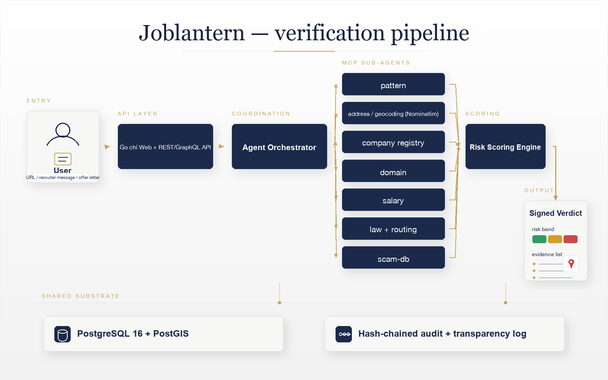

<p align="center">
  
</p>

<p align="center">
  <a href="https://github.com/yasserrmd/joblantern/actions/workflows/ci.yml"></a>
  <a href="https://www.apache.org/licenses/LICENSE-2.0"></a>
  <a href="https://go.dev/dl/"></a>
  <a href="#project-status"></a>
  
</p>

<p align="center">
  <b>Joblantern takes a job listing — a URL, a recruiter message, an offer letter —<br>
  and returns a sourced, reproducible verdict on whether it is safe.</b>
</p>

---

## The problem

Every year, migrant workers and first-time job seekers lose **billions** to
fraudulent recruiters, fake licensing fees, and trafficking-adjacent schemes
that look completely legitimate on the surface. The tools needed to expose
them — company registries, domain history, scam databases, salary benchmarks,
recruitment-fee law — already exist and are mostly free and open. They are
simply not stitched together, and they are not in the hands of the people at
risk, in the language they speak, on the device they own.

**Joblantern stitches them together** behind a single question: *is this job real?*

## How it works

A submission is fanned out to a panel of specialist sub-agents — each wrapping
one open data source through the Model Context Protocol — whose findings are
fused by a deterministic risk engine into one of three bands. Every signal
cites its source, and every verdict is reproducible.

<p align="center">
  
</p>

| Stage | What happens |
|-------|--------------|
| **Submit** | A URL, pasted recruiter message, or offer letter — via web, kiosk, bot, or REST/GraphQL API. |
| **Orchestrate** | The agent fans the submission out to MCP sub-agents in parallel. |
| **Investigate** | `pattern` (red-flag language), `address` (geocode + map via Nominatim), `registry` (company exists?), `domain`, `salary`, `law`/`routing`, `scam-db`, and adjacent-domain packs. |
| **Score** | A deterministic engine fuses weighted, sourced facts into a **green / amber / red** band with a confidence figure. |
| **Verdict** | A reproducible result with cited evidence, an optional map of the claimed office, and a publicly verifiable signature. |

## Highlights

- 🔎 **Evidence, not opinions** — every verdict lists weighted facts with the
  tool and source that produced them. Nothing is a black box.
- 🗺️ **Geospatial verification** — the claimed office address is geocoded and
  shown on an OpenStreetMap map; addresses that do not resolve count against
  the listing.
- 🧩 **16 MCP servers** — each open data source is an independent, swappable
  MCP server; deployments enable only what they need.
- 🌐 **Built for the frontline** — multilingual UI, no-JS "lite" mode for
  hostile networks, embassy kiosk mode, caller-ID lookups, and a one-tap
  panic-wipe.
- 🔬 **Open by design** — anonymized research API (REST + GraphQL), a public
  knowledge graph, regulator integration, and citable annual archives.
- 🛡️ **Accountable** — a Trust & Safety Council governs appeals, a hash-chained
  audit log backs every action, and a continuous red-team probes the agent.

## Project status

**Pre-alpha, under active development.** Interfaces and schemas may change.
See [`docs/ROADMAP.md`](docs/ROADMAP.md) and
[`docs/ROADMAP-EXTENDED.md`](docs/ROADMAP-EXTENDED.md) for the full plan.

## Tech stack

| Layer | Choice |
|-------|--------|
| **Language** | Go 1.25+ |
| **Agent** | Multi-agent orchestrator over the [official MCP Go SDK](https://github.com/modelcontextprotocol/go-sdk) |
| **Web / API** | `chi` router · server-rendered templates · REST + GraphQL |
| **Data** | PostgreSQL 16 + PostGIS + pgvector |
| **Geo** | Self-hosted Nominatim + Overpass (OpenStreetMap) |
| **Maps** | Leaflet (self-hosted) on OSM tiles |
| **Observability** | Prometheus + structured `slog` |

Architectural decisions are recorded in [`docs/ADR/`](docs/ADR/).

## Quickstart

### Docker (recommended)

```bash
git clone https://github.com/yasserrmd/joblantern.git
cd joblantern

# Postgres + the address sub-agent + the app
docker compose -f deploy/docker-compose.smoketest.yml up -d --build
```

Open **http://localhost:18080** and submit a listing. Tear down with:

```bash
docker compose -f deploy/docker-compose.smoketest.yml down -v
```

### Local build

```bash
cp .env.example .env
make docker-up      # bring up Postgres
make migrate-up     # run migrations
make build && ./bin/joblantern
```

Visit `http://localhost:8080/healthz` — you should see `ok`.

## Try the API

```bash
curl -s -X POST http://localhost:18080/api/v1/verify \
  -H 'Content-Type: application/json' \
  -d '{
        "listing_text": "URGENT driver wanted Dubai AED 18000, send AED 2500 processing fee via Western Union, no interview, WhatsApp only",
        "company_name": "QuickJobs Gulf",
        "claimed_address": "Business Bay Tower, Dubai",
        "jurisdiction": "AE"
      }'
# → { "verification_id": "…" }   then GET /api/v1/verifications/<id>
```

The verdict comes back **red** with cited red-flag evidence (extraordinary pay,
wire-only fee, no interview) and — if the address resolves — a map pin.

## Documentation

| Area | Docs |
|------|------|
| Architecture & decisions | [`docs/ADR/`](docs/ADR/) |
| Self-hosting | [`docs/SELF-HOSTING.md`](docs/SELF-HOSTING.md) · [`docs/SCALING-RUNBOOK.md`](docs/SCALING-RUNBOOK.md) |
| Research & data | [`docs/RESEARCH-API.md`](docs/RESEARCH-API.md) · [`docs/KNOWLEDGE-GRAPH.md`](docs/KNOWLEDGE-GRAPH.md) |
| Frontline modes | [`docs/EMBASSY-KIOSK.md`](docs/EMBASSY-KIOSK.md) · [`docs/CALLER-ID.md`](docs/CALLER-ID.md) · [`docs/HOSTILE-NETWORK.md`](docs/HOSTILE-NETWORK.md) |
| Governance | [`docs/GOVERNANCE.md`](docs/GOVERNANCE.md) · [`docs/COUNCIL-CHARTER.md`](docs/COUNCIL-CHARTER.md) · [`docs/TRANSPARENCY.md`](docs/TRANSPARENCY.md) |
| Compliance | [`docs/COMPLIANCE/`](docs/COMPLIANCE/) (GDPR / DPDPA / PDPL) |

## License

Apache License 2.0 — see [LICENSE](LICENSE) and [NOTICE](NOTICE).

Every dependency that ships in the Joblantern binary must be permissively
licensed (Apache 2.0, BSD, MIT). No GPL, AGPL, LGPL, SSPL, BUSL, or Elastic
License code may be linked in.

## Contributing & security

- Contributions are accepted under the Developer Certificate of Origin — see [CONTRIBUTING.md](CONTRIBUTING.md).
- Report vulnerabilities per [SECURITY.md](SECURITY.md).
- Community expectations: [CODE_OF_CONDUCT.md](CODE_OF_CONDUCT.md).

## Author

**Mohamed Yasser** — Solutions Architect.
